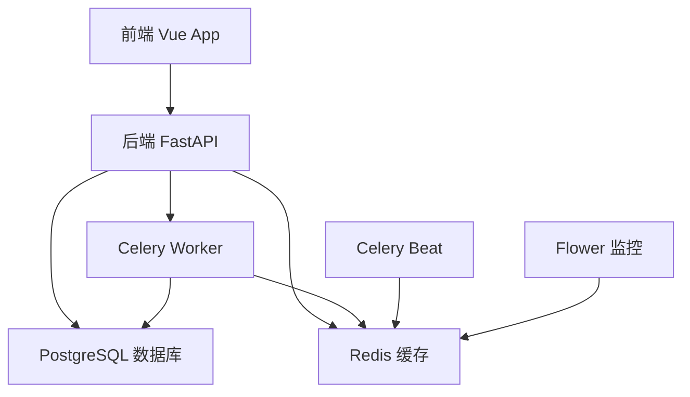

# Docker 部署指南

> **送达回证自动化处理系统** - 完整的Docker容器化部署方案

## 🚀 快速启动

### 一键启动所有服务
```bash
# 克隆项目
git clone <repository-url>
cd final_SDHZ

# 启动所有服务 (首次启动会自动构建镜像)
docker-compose up -d

# 查看服务状态
docker-compose ps

# 查看实时日志
docker-compose logs -f

# 查看特定服务日志
docker-compose logs -f backend
docker-compose logs -f frontend
```

### 🌐 访问应用
- **前端应用**: http://localhost (端口 80)
- **后端API**: http://localhost:8000
- **API文档**: http://localhost:8000/docs
- **API替代文档**: http://localhost:8000/redoc
- **Celery监控**: http://localhost:5555 (可选)
- **默认管理员账号**: admin / ww731226

### ✅ 服务健康检查
```bash
# 检查所有服务状态
docker-compose ps

# 检查后端API健康状态
curl http://localhost:8000/health

# 检查前端服务
curl http://localhost/
```

## 📋 服务架构概览

| 服务名称 | 容器名 | 端口映射 | 技术栈 | 说明 |
|---------|--------|----------|--------|------|
| **frontend** | sdhz_frontend | 80:80 | Vue 3 + Nginx | 前端Web应用，用户界面 |
| **backend** | sdhz_backend | 8000:8000 | FastAPI + Uvicorn | 后端API服务，核心业务逻辑 |
| **postgres** | sdhz_postgres | 5432:5432 | PostgreSQL 15 | 主数据库，持久化存储 |
| **redis** | sdhz_redis | 6379:6379 | Redis 7 | 缓存服务，任务队列 |
| **celery-worker** | sdhz_celery_worker | - | Celery | 异步任务处理器 |
| **celery-beat** | sdhz_celery_beat | - | Celery Beat | 定时任务调度器 |
| **flower** | sdhz_flower | 5555:5555 | Flower | Celery监控界面 (可选) |

### 🔗 服务依赖关系


### 📊 资源配置
| 服务 | CPU限制 | 内存限制 | 存储 |
|------|---------|----------|------|
| frontend | 0.5核 | 512MB | - |
| backend | 1.0核 | 1GB | uploads/ |
| postgres | 0.5核 | 1GB | postgres_data |
| redis | 0.25核 | 256MB | redis_data |
| celery-worker | 1.0核 | 1GB | - |

## 🛠️ 开发环境

### 启动开发环境
```bash
# 仅启动数据库和缓存服务
docker-compose up -d postgres redis

# 本地运行后端（用于开发调试）
cd backend
python -m venv venv
source venv/bin/activate
pip install -r requirements.txt
uvicorn app.main:app --reload

# 本地运行前端（用于开发调试）
cd frontend
npm install
npm run dev
```

### 重新构建镜像
```bash
# 重新构建所有服务
docker-compose build

# 重新构建特定服务
docker-compose build frontend
docker-compose build backend

# 强制重新构建（不使用缓存）
docker-compose build --no-cache
```

## 🔧 配置说明

### 环境变量
主要环境变量在 `docker-compose.yml` 中配置：

- **数据库配置**:
  - `POSTGRES_SERVER=postgres`
  - `POSTGRES_USER=postgres`
  - `POSTGRES_PASSWORD=postgres`
  - `POSTGRES_DB=delivery_receipt`

- **Redis配置**:
  - `REDIS_URL=redis://redis:6379/0`
  - `CELERY_BROKER_URL=redis://redis:6379/0`

### 数据持久化
- PostgreSQL 数据: `postgres_data` 卷
- Redis 数据: `redis_data` 卷
- 上传文件: `./backend/uploads` 目录挂载

### 网络配置
- 所有服务运行在 `sdhz_network` 桥接网络中
- 前端通过 nginx 反向代理访问后端 API
- 服务间通过容器名进行通信

## 📁 Docker 文件结构

```
final_SDHZ/
├── docker-compose.yml          # 主编排文件
├── Dockerfile                  # 多服务构建文件
├── .dockerignore              # Docker忽略文件
├── frontend/
│   ├── Dockerfile             # 前端专用构建文件
│   └── .dockerignore         # 前端忽略文件
└── backend/
    ├── Dockerfile             # 后端专用构建文件（已存在）
    └── docker-compose.yml     # 后端专用编排（已存在）
```

## 🔍 故障排除

### 常用命令
```bash
# 查看所有容器状态
docker-compose ps

# 查看特定服务日志
docker-compose logs backend
docker-compose logs frontend

# 进入容器内部调试
docker-compose exec backend bash
docker-compose exec frontend sh

# 重启特定服务
docker-compose restart backend

# 停止所有服务
docker-compose down

# 停止并删除数据卷（谨慎使用）
docker-compose down -v
```

### 常见问题

1. **端口占用**
   ```bash
   # 检查端口占用
   netstat -tulpn | grep :80
   netstat -tulpn | grep :8000
   
   # 修改 docker-compose.yml 中的端口映射
   ```

2. **权限问题**
   ```bash
   # 确保上传目录权限正确
   sudo chown -R $USER:$USER ./backend/uploads
   ```

3. **数据库连接失败**
   ```bash
   # 检查数据库服务状态
   docker-compose logs postgres
   
   # 等待数据库完全启动
   docker-compose up -d postgres
   sleep 10
   docker-compose up -d backend
   ```

4. **前端无法访问后端**
   - 检查 nginx 配置中的代理设置
   - 确认后端服务已启动
   - 查看网络连接: `docker network ls`

## 🚀 生产部署

### 优化配置
1. **环境变量**: 使用 `.env` 文件管理敏感信息
2. **资源限制**: 添加内存和CPU限制
3. **安全配置**: 修改默认密码，启用HTTPS
4. **监控日志**: 配置日志收集和监控

### 示例 .env 文件
```env
POSTGRES_PASSWORD=your_secure_password
POSTGRES_USER=your_db_user
POSTGRES_DB=your_db_name
REDIS_PASSWORD=your_redis_password
```

### 使用 .env 文件
```bash
# 复制环境变量模板
cp .env.example .env

# 编辑环境变量
vim .env

# 启动服务（自动加载.env）
docker-compose up -d
```

## 📊 监控和维护

### 健康检查
所有服务都配置了健康检查，可以通过以下命令查看：
```bash
docker-compose ps
# 显示每个服务的健康状态
```

### 日志管理
```bash
# 查看所有服务日志
docker-compose logs

# 跟踪实时日志
docker-compose logs -f

# 查看最近100行日志
docker-compose logs --tail=100
```

### 性能监控
- **Celery监控**: 访问 http://localhost:5555
- **PostgreSQL监控**: 可以连接数据库查看性能指标
- **容器监控**: 使用 `docker stats` 查看资源使用情况

---

🌟 **如果遇到问题，请检查日志文件或提交 Issue！**